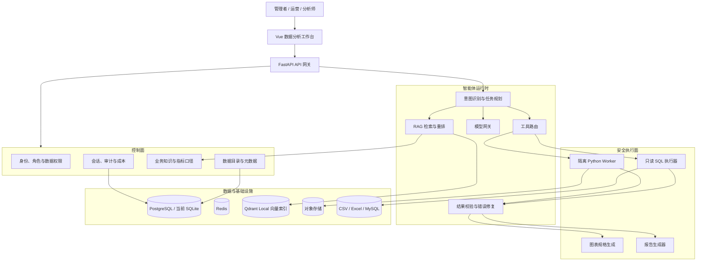
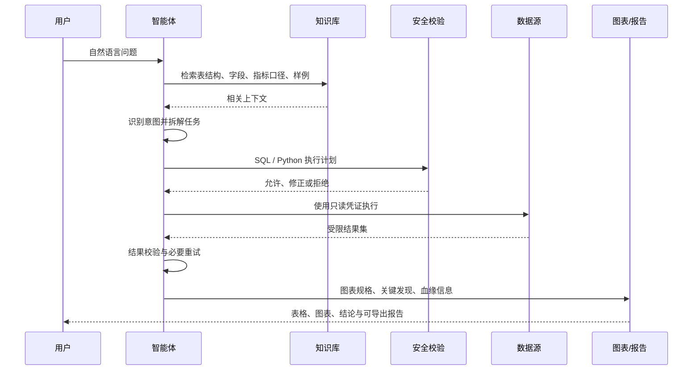

# 数据智能体服务系统总体架构

## 1. 架构目标

系统面向企业管理者、运营人员和数据分析师，提供“自然语言提问—数据理解—任务规划—SQL/Python 分析—安全执行—图表—结论—报告”的闭环。架构优先保证数据安全、结果可解释、执行可审计，并允许模型、向量库和数据源按企业环境替换。

## 2. 总体架构

## 3. 模块边界

| 模块 | 职责 | 当前 MVP | 生产演进 |
|---|---|---|---|
| 数据目录 | 数据源、表、字段、样例、质量信息 | SQLite 元数据 + 文件上传 | PostgreSQL + 元数据采集任务 |
| 知识库 | 指标口径、字段解释、规则、历史样例 | Embedding + Qdrant Local，失败时关键词降级 | Qdrant Server + Rerank |
| 智能体编排 | 意图、步骤、工具选择、上下文 | 确定性规划器 | 持久化工作流 + LLM Planner |
| 模型网关 | 隔离供应商差异、超时、重试、限额 | OpenAI 兼容接口 | 多模型路由、缓存、成本策略 |
| SQL 工具 | 生成、校验、执行、限制结果集 | SQLite 只读查询 | SQL AST 校验、数据库只读账号、行列权限 |
| Python 工具 | 统计、异常、同比环比、多表计算 | 固定算法边界 | 容器沙箱、禁网、资源限额、临时文件隔离 |
| 展示报告 | 表格、图表、结论、导出 | ECharts + HTML | Word/PDF/Markdown 异步导出 |
| 治理运维 | RBAC、审计、链路、质量、成本 | 审计表与配置状态 | OIDC、OpenTelemetry、评测集、告警 |

## 4. 核心分析流程

## 5. 安全设计

1. 前端不保存模型或数据库密钥；密钥来自后端环境变量或生产 Secret Manager。
2. 数据库连接使用只读账号，查询限制为单条 `SELECT/WITH`，设置超时和最大行数。
3. 权限决策在生成前提供可见元数据，在执行前再次校验表、字段与租户范围。
4. Python 分析不得在 API 进程中执行；生产环境使用独立容器，禁用网络并设置 CPU、内存、时长和文件配额。
5. 审计记录用户问题、检索上下文、生成语句、执行状态、导出动作；日志中脱敏密钥和敏感字段。
6. LLM 默认只接收元数据和聚合结果。原始明细外发必须经过企业策略明确授权。

## 6. 部署拓扑

MVP 采用模块化单体，便于快速迭代：Vue 静态站点、FastAPI 服务、SQLite。生产环境建议部署在 Kubernetes：

- `web`：静态资源与反向代理。
- `api`：控制面、目录、会话和智能体入口，无状态横向扩容。
- `worker-sql`：数据库查询任务，按数据源网络域部署。
- `worker-python`：短生命周期沙箱任务。
- `postgresql`：配置、元数据、会话、审计。
- `redis`：会话热数据、限流、任务状态。
- `qdrant`：知识向量索引；单机使用 Local Mode，扩容时切换 Server。
- `object-storage`：上传文件、图表和报告产物。

## 7. 实施路线

- 阶段 1（当前）：演示数据、CSV/Excel、元数据、本地知识检索、只读 SQL、图表、HTML 报告。
- 阶段 2：MySQL 连接器、真实 LLM Planner、Qdrant Server、指标语义层与上下文摘要压缩。
- 阶段 3：Python 沙箱、异常归因、数据血缘、Word/PDF 导出、离线评测集。
- 阶段 4：OIDC/RBAC、多租户、行列权限、可观测性、模型路由和成本治理。
